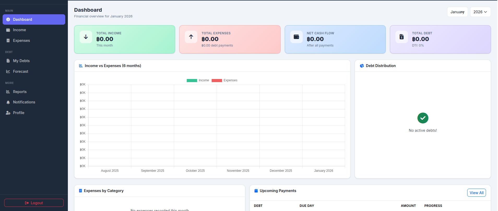

# Money Manager — PHP + MySQL

A modern personal finance web application for salary and debt management.



## Features

- **Auth** — register, login, forgot password
- **Income** — salary, bonus, freelance, passive, other (per month)
- **Expenses** — by category (food, transport, utilities…) recurring & one-time
- **Debt Management** — multiple loan types with full detail cards
- **Debt Forecast** — avalanche & snowball strategies, what-if extra payment simulator
- **Reports** — yearly summary, CSV export, print-friendly
- **Notifications** — auto-generated payment-due alerts
- **Profile** — name, currency, password change

## Tech Stack

| Layer    | Tech                          |
|----------|-------------------------------|
| Backend  | PHP 8+ (PDO, sessions)        |
| Database | MySQL 5.7+ / MariaDB 10.3+    |
| Frontend | Bootstrap 5.3, Chart.js 4, FA6|
| Dialogs  | SweetAlert2                   |

## Quick Start

### 1. Create the database

```bash
mysql -u root -p < sql/schema.sql
```

This creates `money_management` with sample data.  
Demo login: **demo@example.com** / **demo1234**

### 2. Configure DB connection

Edit `config/db.php`:
```php
define('DB_HOST', 'localhost');
define('DB_NAME', 'money_management');
define('DB_USER', 'root');
define('DB_PASS', '');
define('APP_URL',  'http://localhost/money-management');
```

### 3. Place files in your web server

```
/var/www/html/money-management/   (Apache)
/usr/share/nginx/html/money-management/  (Nginx)
```

Or use PHP's built-in server:
```bash
php -S localhost:8000 -t /path/to/money-management
# then set APP_URL = 'http://localhost:8000'
```

## Project Structure

```
money-management/
├── config/db.php          # DB config & PDO connection
├── includes/
│   ├── auth.php           # Session auth helpers
│   ├── functions.php      # Utilities, interest calculations
│   ├── header.php         # HTML head + top navbar
│   ├── sidebar.php        # Sidebar navigation
│   └── footer.php         # Scripts + closing tags
├── assets/
│   ├── css/style.css      # Custom styles (fintech theme)
│   └── js/
│       ├── app.js         # Sidebar toggle, utils
│       └── charts.js      # Dashboard charts
├── sql/schema.sql         # DB schema + sample data
├── index.php              # Redirect
├── login.php / register.php / forgot-password.php / logout.php
├── dashboard.php          # Main dashboard + KPIs + charts
├── income.php             # Income CRUD
├── expenses.php           # Expense CRUD
├── debts.php              # Debt cards + payment recording
├── forecast.php           # Debt-free simulator
├── reports.php            # Annual reports + CSV export
├── notifications.php      # Alert center
└── profile.php            # Account settings
```

## Interest Types Supported

| Type            | Description                          |
|-----------------|--------------------------------------|
| Reducing balance | Interest on outstanding balance      |
| Flat rate        | Fixed interest on original principal |
| Compound        | Interest compounded monthly           |
| Credit card     | Monthly APR on balance               |
| Fixed           | Same as reducing                     |

## Security

- Passwords hashed with `password_hash(PASSWORD_BCRYPT)`
- All DB queries use PDO prepared statements
- CSRF token on all forms
- HTML output escaped with `htmlspecialchars()`
